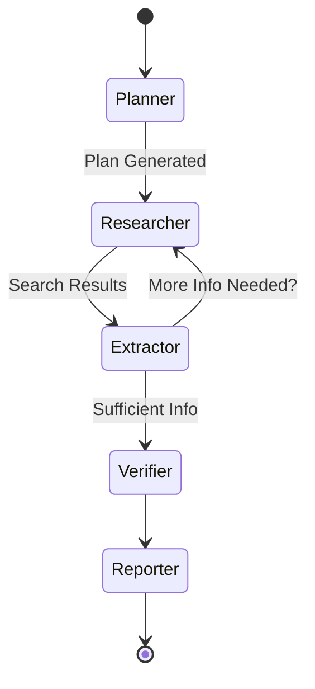

# 🧠 Building a Brain: The Design of an Autonomous Research Agent

  
    
  <i>Exploring the architecture of a Multi-Step Reasoning Agent using LangGraph and NetworkX</i>

---

## 1. The Challenge of "Deep Research"

Standard LLM chatbots (like Gemini/ChatGPT) are excellent at answering questions based on their training data. However, when asked to "Research the impact of quantum computing on modern cryptography," they often fail to:
1.  **Go Deep**: They provide a surface-level summary.
2.  **Verify**: They might hallucinate specific details.
3.  **Connect Dots**: They don't typically build a structured understanding of *relationships* between entities found during the session.

To solve this, we need an **Agentic Workflow**—a system that can **Plan**, **Act**, **Observe**, and **Correct**.

---

## 2. Core Architecture: Why LangGraph?

We chose **LangGraph** over simple LangChain chains because research is inherently **cyclic**.

- **Linear Chains**: A -> B -> C (Good for simple tasks)
- **Cyclic Graphs**: A -> B -> C -> (maybe back to B?) -> D (Required for research)

### The Research Loop
Our agent implements a variation of the **ReAct** (Reasoning + Acting) pattern, but enhanced with a global **Plan**.

1.  **Planner**: Uses an LLM to decompose the user's vague request into specific, testable questions.
    *   *User*: "Analyze the crypto market."
    *   *Planner*: ["Search for Bitcoin price trends", "Search for Ethereum regulatory news", ...]
2.  **Researcher**: Executes the first step of the plan using **DuckDuckGo**.
3.  **Extractor**: Reads the search results and—crucially—extracts "Triplets" (Subject -> Predicate -> Object).
4.  **Loop**: The system checks if it has covered the plan. If not, it loops back to the Researcher with the next step.

---

## 3. The "Brain": Knowledge Graph Validation

Most RAG (Retrieval Augmented Generation) systems just dump text chunks into a vector database. We take a different approach: **Structured Knowledge Graphs**.

### From Text to Graph
When the agent reads: *“Alice works at DeepMind, which was acquired by Google.”*

Instead of storing just strings, our **Extractor Node** parses this into:
- `(Alice, works_at, DeepMind)`
- `(DeepMind, acquired_by, Google)`

We use **NetworkX** to store this graph in memory. This allows the user to see exactly *what* the agent thinks it knows.

> [!NOTE]
> **Why NetworkX?**
> For this local implementation, NetworkX is lightweight and requires no external Docker containers (unlike Neo4j). It's perfect for a portable "brain."

---

## 4. Trust but Verify: The Fact-Checking Module

Hallucination is the enemy of research. To combat this, we introduced a **Verifier Node** right before the final report generation.

This node:
1.  Looks at the aggregated research logs.
2.  Identifies conflicting information (e.g., Source A says "released in 2020", Source B says "2021").
3.  Assigns a simplistic "credibility score" to the findings.
4.  Injects a "Verification Report" into the context for the final writer.

---

## 5. Visualizing the Process (Streamlit)

A black-box agent is scary. We built a **Streamlit** interface to make the brain transparent.

- **Status Stream**: We stream every state transition (`agent_app.astream`) so the user sees "Planner -> Researcher".
- **Graph Viz**: We use `matplotlib` to render the NetworkX graph in real-time.
- **Dual Export**: Users can download the final grounded report as a DOCX or Markdown file for immediate distribution.

---

## 6. Future Roadmap

1.  **Persistent Memory**: Move from NetworkX to **Neo4j** or **ArangoDB** for long-term project memory.
2.  **Browser Control**: Replace simple HTTP requests with a headless browser (Playwright) to handle JavaScript-heavy sites.
3.  **Human-in-the-Loop**: Allow the user to pause the agent and manually edit the plan mid-research.

---

*This project demonstrates that with the right orchestration tools, we can move beyond "Chatbots" to true "Research Assistants."*
