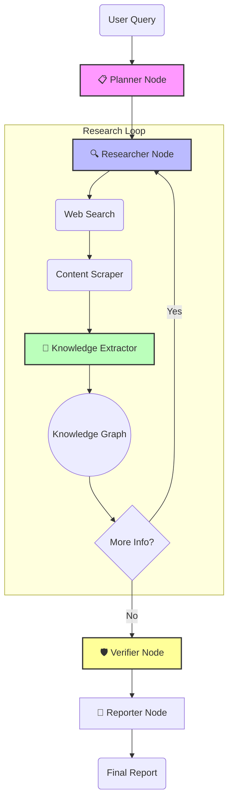

<div align="center">

#  Autonomous Research Agent
### *Deep Research with Multi-Step Reasoning & Knowledge Graphs*

[](https://python.org)
[](https://streamlit.io)
[](https://langchain.com)
[](LICENSE)

[**Live Demo**](#-live-demo) • [**Architecture**](#-architecture) • [**Setup**](#%EF%B8%8F-setup) • [**Blog Post**](BLOG_POST.md)


</div>

---

## 🚀 Overview

The **Autonomous Research Agent** is a cutting-edge AI system designed to conduct comprehensive research on complex topics. Unlike simple chatbots, this agent **plans** its research, **executes** searches, **scrapes** content, **builds** a knowledge graph, and **verifies** its findings before generating a final report.

It leverages **LangGraph** for cyclic state management and **NetworkX** for constructing a dynamic web of knowledge.

### ✨ Key Features

- **🧠 Multi-Step Planner**: Decomposes high-level queries into actionable steps (ReAct/REWOO pattern).
- **🌐 Autonomous Web Researcher**: Iteratively searches web results (DuckDuckGo/Tavily) and scrapes content.
- **🕸️ Knowledge Graph Construction**: Automatically extracts entities and relationships (Triplets) from text.
- **🛡️ Fact-Checking & Credibility**: Verifier node cross-references facts to ensure accuracy.
- **📊 Real-time Monitoring**: Built-in Prometheus metrics for token usage and latency tracking.
- **📄 Dual Export**: Download reports in both Markdown (.md) and Microsoft Word (.docx) formats.
- **🎨 Interactive UI**: A beautiful Streamlit interface to visualize the agent's thought process and graph.

---

## 🏗️ Architecture

The agent is built as a state machine using **LangGraph**. Below is the high-level workflow:



---

## ⚡ Quick Start

<details>
<summary><b>1. Prerequisites</b></summary>
<br>

- Python 3.10 or higher
- A Google Gemini API Key
</details>

<details>
<summary><b>2. Installation</b></summary>
<br>

Clone the repository and install dependencies:

```bash
git clone https://github.com/luckyramguguloth/Autonomous-Research-Agent.git
cd Autonomous-Research-Agent
pip install -r requirements.txt
```
</details>

<details>
<summary><b>3. Configuration</b></summary>
<br>

Create a `.env` file in the root directory:

```bash
# Required
GOOGLE_API_KEY=AIzaSy...

# Optional (for better search)
TAVILY_API_KEY=tvly-...
```
</details>

<details>
<summary><b>4. Run the Application</b></summary>
<br>

Launch the Streamlit dashboard:

```bash
streamlit run app.py
```

Visit `http://localhost:8501` in your browser.
</details>

---

## 📦 Project Structure

```bash
📦 Autonomous Research Agent
 ┣ 📂 src
 ┃ ┣ 📂 agent           # Core LangGraph logic
 ┃ ┃ ┣ 📜 workflow.py   # StateGraph definition
 ┃ ┃ ┣ 📜 planner.py    # Planning logic
 ┃ ┃ ┗ 📜 ...
 ┃ ┣ 📂 graph           # NetworkX Manager
 ┃ ┣ 📂 tools           # Search & Scraper tools
 ┃ ┗ 📂 utils           # Metrics & Helpers
 ┣ 📂 tests             # Pytest suite
 ┣ 📜 app.py            # Streamlit Entry point
 ┣ 📜 requirements.txt  # Dependencies
 ┗ 📜 BLOG_POST.md      # Detailed Design Docs
```

---

## 🔍 In-Depth Components

| Component | Technology | Description |
|-----------|------------|-------------|
| **Orchestrator** | `LangGraph` | Manages the cyclic workflow and state. |
| **LLM** | `Gemini 3 Flash` | Powers planning, extraction, and writing. |
| **Search** | `DuckDuckGo` | Retrieves real-time information from the web. |
| **Graph DB** | `NetworkX` | In-memory graph for entity relationships. |
| **UI** | `Streamlit` | Frontend with Word/MD export options. |

---

## 📊 Monitoring

The application exposes Prometheus metrics at `http://localhost:8000`:
- `research_agent_search_queries_total`: Count of searches performing.
- `research_agent_llm_tokens_total`: Estimated token usage.
- `research_agent_request_latency_seconds`: Latency distribution.

---

<div align="center">
Built with ❤️ using 🦜🔗 LangChain & LangGraph
</div>
"# Autonomous-Research-Agent" 
